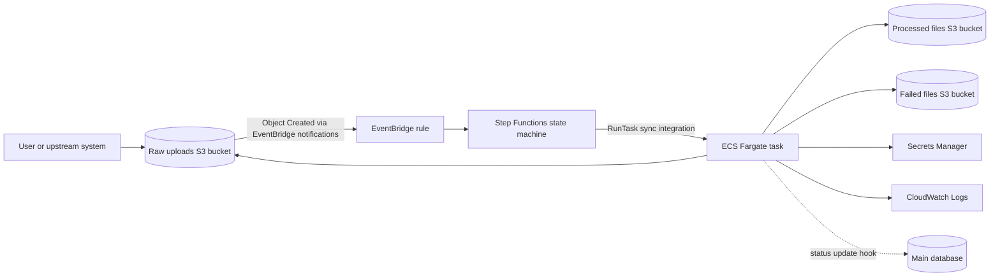

# Data Processing Infrastructure

AWS CDK v2 TypeScript solution for a small CSV processing pipeline. Users upload large customer CSV files to S3, an EventBridge rule starts a Step Functions workflow, and the workflow runs a one-off ECS Fargate task that represents the black-box processor.

The processor application itself is intentionally not implemented. The current container uses `public.ecr.aws/docker/library/busybox:latest` as a placeholder and should be replaced by the real image in production.

## Architecture



## Flow

1. A CSV file is uploaded to the raw uploads bucket.
2. The raw bucket emits S3 Object Created events to EventBridge.
3. EventBridge starts the Step Functions state machine with the original S3 event payload.
4. Step Functions runs a Fargate task using the native ECS integration.
5. The workflow passes `JOB_ID`, `RAW_BUCKET`, and `OBJECT_KEY` to the container as environment overrides.
6. The task reads the raw object, writes successful output to the processed bucket, and writes failed artifacts to the failed bucket.
7. Placeholder Step Functions `Pass` states mark where job status updates to a database or job table would happen.

## Design Decisions

- One CDK stack keeps the assignment easy to review and avoids unnecessary module structure.
- S3 buckets block public access, enforce SSL, and use S3-managed encryption for a simple secure default.
- Raw uploads expire after 7 days because the canonical result should live in the processed output and main database.
- EventBridge notifications are enabled on the raw bucket so object creation can start the workflow without Lambda glue code.
- Step Functions uses `ecs:runTask.sync`, which is a good fit for 5-10 minute file processing jobs and gives workflow-level retry/failure handling.
- Fargate CPU and memory are set to `1024` CPU units and `2048` MiB for a demo-sized task. Real sizing should be based on processor profiling and CSV memory behavior.
- The demo VPC uses public subnets and no NAT gateway to keep deployment cost low. A production deployment would usually use private subnets plus NAT or VPC endpoints.

## Security Considerations

- Public S3 access is blocked on all buckets.
- Buckets enforce TLS using `enforceSSL`.
- The ECS task role is granted read access only to the raw bucket, write access only to the processed and failed buckets, and read access only to the two placeholder secrets.
- Secrets Manager stores placeholder database credentials and an external API key. The stack passes secret ARNs to the task; the application would retrieve values at runtime.
- IAM permissions are intentionally resource-scoped through CDK grants where possible.
- Production systems should consider customer-managed KMS keys, stricter network egress controls, malware scanning, object ownership rules, and audit retention requirements.

## Trade-offs

- No Lambda preprocessor is included; Step Functions receives the S3 event directly from EventBridge to keep the design small.
- No database, RDS proxy, or job table is deployed because the prompt treats the processor and main database as external concerns.
- The placeholder processor command only logs and sleeps. It demonstrates orchestration without pretending to scrub or enrich CSV data.
- Fargate is simpler than a persistent ECS service or AWS Batch for this assignment. AWS Batch could be attractive for heavier scheduling, queues, or very high concurrency.

## Future Improvements

- Replace the BusyBox image with the real processor image in ECR.
- Add a job metadata table for idempotency, status tracking, retry visibility, and user-facing progress.
- Add dead-letter handling or operational alerts for failed workflow executions.
- Add private subnets, VPC endpoints, and tighter outbound access for production networking.
- Add reserved concurrency controls or EventBridge/SQS buffering if many large files can arrive at once.
- Add integration tests that assert the synthesized IAM policy scope and Step Functions input paths.

## Deployment

```bash
npm install
npm run build
cdk synth
cdk deploy
```

The stack outputs the raw, processed, and failed bucket names after deployment.
