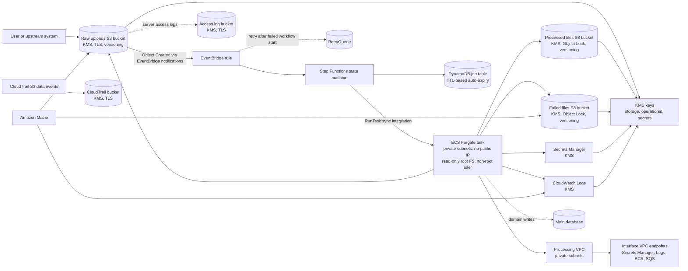

# Data Processing Infrastructure

[](https://github.com/tukue/data-processing-infrastructure/actions/workflows/ci.yml)
[](LICENSE)
[](https://aws.amazon.com/cdk/)
[](https://www.typescriptlang.org/)
[](https://www.openpolicyagent.org/)

Production-oriented AWS CDK v2 infrastructure for an event-driven CSV processing pipeline. Validated through policy-as-code with OPA/Rego.

## Highlights

- **Fully event-driven** — S3 uploads trigger Step Functions via EventBridge, no Lambda glue code
- **Secure by default** — KMS encryption everywhere, S3 Object Lock (Compliance mode), VPC endpoints, least-privilege IAM
- **Policy-as-code** — OPA/Rego policies in CI enforce security & operational guardrails on every commit
- **Cost-aware** — NAT Gateway is only deployed when needed; configurable retention, TTL-based DynamoDB cleanup
- **Fargate-native** — Long-running CSV processing via ECS Fargate tasks (5-10 min), not Lambda
- **Tested infrastructure** — Jest snapshot tests + OPA validation + CDK Nag support

## Architecture



## Quick Start

```bash
npm install
aws configure
cdk bootstrap aws://<account-id>/<region>
npm run build && cdk deploy
```

See full [deployment docs](#deployment) for configuration options.

## Features

### Security Posture

| Control | Implementation |
|---|---|
| Encryption at rest | Customer-managed KMS keys per tier (storage, operational, secrets) with auto-rotation |
| Encryption in transit | TLS enforced on all S3 buckets; VPC endpoints for AWS services |
| Object immutability | S3 Object Lock in Compliance mode for processed & failed buckets |
| Access isolation | Bucket policy Deny rules scoped to ECS task role only |
| Secrets management | ECS Secrets injection — task role has no secretsmanager:GetValue |
| Container hardening | Non-root user, read-only root filesystem, digest-pinned images |
| Audit trail | CloudTrail with S3 data events for all data buckets |
| PII visibility | Amazon Macie for sensitive data discovery with EventBridge alerting |
| Network isolation | Private subnets, no public IP, scoped HTTPS egress |

### Cost Optimization

| Feature | Savings |
|---|---|
| Conditional NAT Gateway | ~$32/mo saved when enrichment APIs are not configured |
| DynamoDB TTL auto-cleanup | Free — reduces manual intervention and storage costs |
| Configurable log retention | Pay only for what you need (default: 30 days) |
| PAY_PER_REQUEST DynamoDB | No provisioned capacity waste for variable workloads |

### Observability

- Step Functions execution logs and X-Ray tracing
- CloudWatch Logs with KMS encryption for processor containers
- Macie findings routed to CloudWatch Logs and SNS alert topic
- CloudTrail data events for object-level audit across all S3 buckets
- DynamoDB job status table with TTL-based expiry

## Stack

- **AWS CDK v2** (TypeScript) — infrastructure as code
- **Amazon S3** — raw uploads, processed files, failed artifacts, access logs
- **AWS Step Functions** — workflow orchestration with native ECS integration
- **Amazon ECS Fargate** — long-running CSV processor tasks in private subnets
- **Amazon DynamoDB** — job metadata ledger with TTL-based auto-cleanup
- **Amazon EventBridge** — S3 event ingestion and Macie finding routing
- **Amazon Macie** — sensitive data discovery
- **AWS CloudTrail** — object-level audit trail
- **AWS KMS** — customer-managed keys per data tier
- **Amazon SQS** — dead-letter queue for failed workflow invocations
- **AWS Secrets Manager** — credential and API key injection
- **Amazon VPC** — isolated networking with interface endpoints
- **Open Policy Agent** — policy-as-code validation in CI

## Design Decisions

- **Single stack:** One CDK stack keeps the infrastructure easy to review. The app avoids premature module boundaries while still separating deployment configuration into a small helper for testability.
- **Event-driven orchestration:** S3 Object Created events flow through EventBridge directly into Step Functions. This avoids Lambda glue code and keeps retry/failure behavior visible in the workflow.
- **Fargate for long-running work:** Processing takes 5-10 minutes, which is too long for a simple synchronous request path. A one-off Fargate task fits a black-box container processor without requiring a continuously running ECS service.
- **Step Functions native ECS integration:** The workflow uses the native `ecs:runTask.sync` integration so Step Functions waits for task completion and can apply workflow-level retry and catch handling.
- **Private task networking:** Fargate tasks run in private subnets with no public IP. Interface VPC endpoints for Secrets Manager, CloudWatch Logs, ECR, and SQS keep service traffic within the AWS network. A NAT gateway is conditionally included only when enrichment API CIDRs are configured.
- **Data protection by default:** S3 buckets block public access, enforce SSL, use bucket-owner-enforced object ownership, versioning, and customer-managed KMS encryption. Processed and failed buckets use S3 Object Lock in Compliance mode — objects cannot be deleted or overwritten until the retention period expires, even by the root user.
- **Multipart uploads for large files:** The raw bucket is intended to receive large CSV files through S3 multipart upload. This improves reliability for multi-GB files and lets clients retry individual parts instead of restarting the whole upload.
- **Job metadata table:** Step Functions persists job status in DynamoDB using a deterministic key based on bucket, object key, and S3 sequencer. Records auto-expire via TTL after the configured retention period.
- **Failure isolation:** EventBridge target retries are bounded and failed state-machine invocations are sent to `RetryQueue`. Processor failures are captured in the state machine and reflected in the job table before the workflow fails.
- **Workflow observability:** Step Functions execution logs and X-Ray tracing are enabled so orchestration failures can be diagnosed without relying only on container logs.
- **PII visibility with Macie:** Amazon Macie is enabled for the account/region and Macie findings are captured through EventBridge into both an encrypted CloudWatch log group and an SNS topic for operational alerting.
- **Per-bucket data retention:** Raw uploads, processed files, and failed processing artifacts each have their own configurable retention period via CDK context or environment variables. Raw and failed files default to 7 days because they can contain unsanitized PII. Processed files default to 7 days as well but can be extended independently for audit or reprocessing needs.
- **Least-privilege task role:** The task role can read raw inputs and write processed/failed outputs. Secrets are injected by the ECS agent via ECS Secrets — the task role has no `secretsmanager:GetValue` permission.
- **Portable deployment:** Account, region, retention periods, processor image, enrichment API CIDRs, processor compute size, and job TTL are all configurable through environment variables or CDK context so the same code can deploy to another AWS account or region without source edits.
- **Configurable processor image:** The stack does not hardcode the processor container. Deployments provide a digest-pinned image URI through `PROCESSOR_IMAGE` or `-c processorImage=...`. Tags like `:latest` are rejected at synthesis time.

## Security Considerations

- Public S3 access is blocked on all buckets.
- Buckets enforce TLS using `enforceSSL`.
- All S3 buckets (raw, processed, failed) have lifecycle expiration configured independently to control data longevity and PII exposure.
- Processed and failed buckets use S3 Object Lock in Compliance mode — objects are WORM-protected for the full retention period.
- All data buckets log access to a dedicated S3 server access log bucket for auditability.
- S3 access is restricted to only the ECS task role via explicit bucket policy Deny rules.
- S3, DynamoDB, SQS, Secrets Manager, and CloudWatch Logs use separate customer-managed KMS keys per data tier (storage, operational, secrets) to limit blast radius. All keys have rotation enabled.
- CloudTrail is enabled with S3 data events for all three data buckets to support object-level audit.
- Amazon Macie is enabled to support sensitive data discovery and S3 data security findings.
- Macie findings are routed to both CloudWatch Logs and an SNS topic for operational alerting.
- ECS tasks run in private subnets and use a security group that allows DNS plus outbound HTTPS only.
- The placeholder container runs as a non-root user with a read-only root filesystem.
- The ECS task role is granted read access only to the raw bucket and write access only to the processed and failed buckets. Secrets are not accessible to the task role.
- Secrets are injected at container start by the ECS agent using ECS Secrets, not passed as plain-text environment variables.
- Container images must be pinned to a digest (`@sha256:...`) — tags like `:latest` are rejected at synthesis time.
- The Step Functions execution role is explicitly defined and scoped to the specific DynamoDB table, ECS task definition, and log group.
- Interface VPC endpoints for Secrets Manager, CloudWatch Logs, ECR, and SQS keep service traffic within the AWS network.
- The EventBridge rule uses an input transformer to strip sensitive S3 event metadata (user identity, source IP) before passing the event to Step Functions.
- HTTPS egress is scoped to the VPC CIDR (for interface endpoints) and configurable enrichment API CIDRs — no wildcard `0.0.0.0/0` HTTPS egress.
- IAM permissions are intentionally resource-scoped through CDK grants where possible.
- Production systems should still consider malware scanning, stricter API egress allowlists, centralized audit retention, and organization-level guardrails.

## Trade-offs

- No Lambda preprocessor is included; Step Functions receives the S3 event directly from EventBridge to keep the design small.
- No main relational database, RDS proxy, or domain schema is deployed because the prompt treats the processor and main database as external concerns. The DynamoDB table is only an operational job ledger for orchestration status.
- The stack configures the processor runtime environment but does not implement the processor image itself. The container image is expected to own CSV parsing, enrichment, output writing, and any domain database updates.
- A NAT gateway is conditionally deployed based on enrichment API CIDRs. Interface VPC endpoints cover the majority of AWS service traffic.
- Fargate is simpler than a persistent ECS service or AWS Batch for this use case. AWS Batch could be attractive for heavier scheduling, queues, or very high concurrency.
- Multipart upload initiation and presigned URL generation are intentionally outside this stack because the assignment does not include an upload API. A real product would add an authenticated API for creating multipart upload sessions.
- The job table key includes the S3 sequencer, so overwrites of the same object become separate processing records. If the product needs strict one-record-per-object idempotency, use bucket and key alone with conditional writes.
- Macie findings are routed to CloudWatch Logs and an SNS topic. In production, the SNS topic would typically subscribe Slack/PagerDuty or route to Security Hub for a full alerting workflow.

## Intentionally Not Included

- CSV parsing, PII scrubbing, enrichment logic, or database writes inside the processor application.
- Upload API, authentication flow, or presigned multipart upload URL generation.
- Main database, schema migrations, RDS proxy, or data access layer.
- Production alerting, dashboards, runbooks, or incident response automation.
- Multi-account deployment pipeline or automated production deployment.
- Full compliance controls such as data subject deletion workflows, legal hold, or centralized audit retention.

## Future Improvements

- Replace the sample processor image URI with the real pinned processor image in ECR.
- Add user-facing APIs over the job metadata table for progress and retry visibility.
- Add operational alerts for failed workflow executions.
- Add Macie custom data identifiers for domain-specific customer identifiers if the default managed identifiers are not enough.
- Add reserved concurrency controls or EventBridge/SQS buffering if many large files can arrive at once.
- Add integration tests that assert the synthesized IAM policy scope and Step Functions input paths.

## Deployment

```bash
npm install
aws configure
cdk bootstrap aws://<account-id>/<region>
npm run build
cdk synth
cdk deploy
```

`aws configure` should point to the AWS account where you want to deploy. The stack is portable across accounts and regions; set the target account and region through your AWS CLI profile, or export them explicitly:

```bash
export AWS_ACCOUNT_ID=<your-account-id>
export AWS_REGION=<aws-region>
export PROCESSOR_IMAGE=<account-id>.dkr.ecr.<aws-region>.amazonaws.com/csv-processor@sha256:<hex>
cdk bootstrap aws://$AWS_ACCOUNT_ID/$AWS_REGION
cdk deploy
```

If neither `AWS_ACCOUNT_ID` nor `AWS_REGION` is set, CDK uses the active CLI profile/default environment. Resource names are intentionally not exposed in stack outputs to reduce attack surface. Use the AWS CLI or Console to discover resource names after deployment:

```bash
# List S3 buckets with the data-processing prefix
aws s3 ls | grep data

# Find the DynamoDB job table
aws dynamodb list-tables | grep ProcessingJobs

# Find the retry queue
aws sqs list-queues --queue-name-prefix DataProcessingInfrastructure
```

### Configuration Options

All configuration is available through CDK context (`-c key=value`) or environment variables.

| Option | CDK Context | Environment Variable | Default |
|---|---|---|---|
| Processor image | `processorImage` | `PROCESSOR_IMAGE` | Required |
| Raw file retention | `rawFileRetentionDays` | `RAW_FILE_RETENTION_DAYS` | 7 |
| Processed file retention | `processedFileRetentionDays` | `PROCESSED_FILE_RETENTION_DAYS` | 7 |
| Failed file retention | `failedFileRetentionDays` | `FAILED_FILE_RETENTION_DAYS` | 7 |
| Enrichment API CIDRs | `enrichmentApiCidrs` | `ENRICHMENT_API_CIDRS` | (none) |
| Job retention | `jobRetentionDays` | `JOB_RETENTION_DAYS` | 30 |
| Processor CPU | `processorCpu` | `PROCESSOR_CPU` | 1024 |
| Processor memory | `processorMemory` | `PROCESSOR_MEMORY` | 2048 |
| Log retention | `logRetentionDays` | `LOG_RETENTION_DAYS` | 30 |

#### Examples

```bash
# Per-bucket retention
cdk deploy -c rawFileRetentionDays=14 -c processedFileRetentionDays=30 -c failedFileRetentionDays=90

# Processor compute
cdk deploy -c processorCpu=512 -c processorMemory=1024

# Enrichment API CIDRs (enables NAT Gateway automatically)
cdk deploy -c enrichmentApiCidrs=203.0.113.0/24,198.51.100.0/24

# Log retention
export LOG_RETENTION_DAYS=14
cdk deploy
```

The processor image must be pinned to a digest:

```bash
cdk deploy -c processorImage=<account-id>.dkr.ecr.<aws-region>.amazonaws.com/csv-processor@sha256:<hex>
```

Job records in DynamoDB expire after a configurable number of days (default 30):

```bash
cdk deploy -c jobRetentionDays=60
```

Run CDK Nag security checks by setting `CDK_NAG=1`:

```bash
CDK_NAG=1 npx cdk synth
```

## CI/CD

GitHub Actions runs a CI workflow on pull requests and pushes to `main`:

- `npm ci`
- `npm run build`
- `npm test -- --runInBand`
- `npx cdk synth`
- `opa eval` against the synthesized template for IAM, S3, networking, logging, compute, and data guardrails

The workflow intentionally does not deploy yet. For deployment automation, add a separate workflow using GitHub OIDC and an AWS IAM role scoped to this stack instead of storing long-lived AWS access keys in GitHub secrets.

## Policy-as-Code

OPA/Rego policies in [`policy/`](policy/) validate the synthesized CloudFormation template:

| Domain | Policy | Check |
|---|---|---|
| IAM | `deny_iam_policy_star_action` | No wildcard IAM actions |
| IAM | `deny_iam_role_managed_policy_admin` | No AdministratorAccess policy |
| IAM | `deny_iam_role_star_assume` | No wildcard assume-role principals |
| S3 | `deny_s3_no_encryption` | Encryption enabled on all buckets |
| S3 | `deny_s3_no_block_public_access` | Public access blocked |
| S3 | `deny_s3_bucket_acl_not_enforced` | BucketOwnerEnforced ownership |
| S3 | `deny_s3_versioning_disabled` | Versioning enabled |
| Network | `deny_security_group_open_ingress` | No public ingress |
| Network | `deny_security_group_open_egress` | No public egress |
| Logging | `deny_log_group_without_retention` | Retention configured |
| Logging | `deny_cloudtrail_without_validation` | Log file validation |
| Logging | `deny_cloudtrail_without_kms` | KMS encryption |
| Security | `deny_kms_key_rotation_disabled` | Key rotation enabled |
| Security | `deny_secrets_manager_no_encryption` | KMS on secrets |
| Compute | `deny_ecs_task_definition_unpinned_image` | Digest-pinned images |
| Compute | `deny_ecs_task_definition_privileged_mode` | No privileged mode |
| Compute | `deny_ecs_task_definition_root_user` | Non-root user |
| Data | `deny_dynamodb_no_pitr` | Point-in-time recovery |
| Data | `deny_sqs_no_encryption` | KMS on queues |

## Project Structure

```
├── .github/
│   ├── workflows/ci.yml    # CI pipeline
│   └── PULL_REQUEST_TEMPLATE.md
├── bin/
│   └── data-processing-infrastructure.ts  # CDK app entry point
├── lib/
│   ├── data-processing-infrastructure-stack.ts  # Main stack
│   └── deployment-config.ts    # Configuration resolver
├── policy/                # OPA/Rego policies (6 domains)
│   ├── compute.rego
│   ├── data.rego
│   ├── iam.rego
│   ├── logging.rego
│   ├── network.rego
│   ├── s3.rego
│   └── security.rego
├── test/
│   └── data-processing-infrastructure.test.ts
├── package.json
├── tsconfig.json
├── jest.config.js
├── cdk.json
├── CONTRIBUTING.md
└── LICENSE
```

## License

MIT
