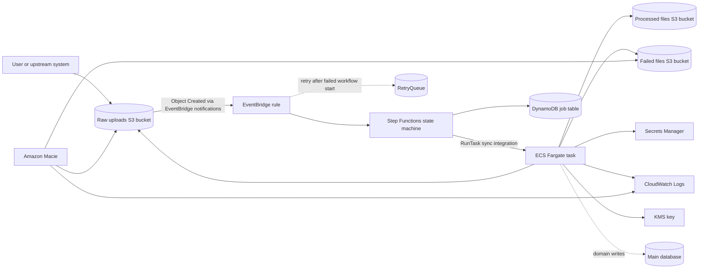

# Data Processing Infrastructure

AWS CDK v2 TypeScript solution for a small CSV processing pipeline. Users upload large customer CSV files to S3, an EventBridge rule starts a Step Functions workflow, and the workflow runs a one-off ECS Fargate task in private subnets that represents the black-box processor.

The processor application itself is intentionally not implemented. The ECS task image is configurable through CDK context or `PROCESSOR_IMAGE` and should point to a pinned private ECR image in production.

## Architecture



## Flow

1. A CSV file is uploaded to the raw uploads bucket.
2. Large uploads should use S3 multipart upload, preferably through the AWS SDK or presigned multipart upload URLs.
3. The raw bucket emits S3 Object Created events to EventBridge after the object is completed.
4. EventBridge starts the Step Functions state machine with the original S3 event payload.
5. Step Functions runs a Fargate task using the native ECS integration.
6. The workflow passes `JOB_ID`, `RAW_BUCKET`, and `OBJECT_KEY` to the container as environment overrides.
7. The task reads the raw object, writes successful output to the processed bucket, and writes failed artifacts to the failed bucket.
8. Step Functions writes job status transitions to DynamoDB: `STARTED`, `SUCCEEDED`, or `FAILED`.
9. EventBridge delivery failures to Step Functions are retried and then sent to `RetryQueue` for operational review.

## Design Decisions

The implementation is intentionally small enough for a take-home assignment, but the resource choices are meant to show production-oriented judgment.

- **Single stack:** One CDK stack keeps the infrastructure easy to review. The app avoids premature module boundaries while still separating deployment configuration into a small helper for testability.
- **Event-driven orchestration:** S3 Object Created events flow through EventBridge directly into Step Functions. This avoids Lambda glue code and keeps retry/failure behavior visible in the workflow.
- **Fargate for long-running work:** Processing takes 5-10 minutes, which is too long for a simple synchronous request path. A one-off Fargate task fits a black-box container processor without requiring a continuously running ECS service.
- **Step Functions native ECS integration:** The workflow uses the native `ecs:runTask.sync` integration so Step Functions waits for task completion and can apply workflow-level retry and catch handling.
- **Private task networking:** Fargate tasks run in private subnets with no public IP. Interface VPC endpoints for Secrets Manager, CloudWatch Logs, and ECR keep service traffic within the AWS network. A NAT gateway is still included so the processor image and future external enrichment API can be reached over HTTPS.
- **Data protection by default:** S3 buckets block public access, enforce SSL, use bucket-owner-enforced object ownership, versioning, and customer-managed KMS encryption. Processed and failed buckets use S3 Object Lock in Compliance mode — objects cannot be deleted or overwritten until the retention period expires, even by the root user.
- **Multipart uploads for large files:** The raw bucket is intended to receive large CSV files through S3 multipart upload. This improves reliability for multi-GB files and lets clients retry individual parts instead of restarting the whole upload.
- **Job metadata table:** Step Functions persists job status in DynamoDB using a deterministic key based on bucket, object key, and S3 sequencer. This gives operators a small, queryable control plane without introducing a relational database into the assignment.
- **Failure isolation:** EventBridge target retries are bounded and failed state-machine invocations are sent to `RetryQueue`. Processor failures are captured in the state machine and reflected in the job table before the workflow fails.
- **Workflow observability:** Step Functions execution logs and X-Ray tracing are enabled so orchestration failures can be diagnosed without relying only on container logs.
- **PII visibility with Macie:** Amazon Macie is enabled for the account/region and Macie findings are captured through EventBridge into both an encrypted CloudWatch log group and an SNS topic for operational alerting.
- **Per-bucket data retention:** Raw uploads, processed files, and failed processing artifacts each have their own configurable retention period via CDK context or environment variables. Raw and failed files default to 7 days because they can contain unsanitized PII. Processed files default to 7 days as well but can be extended independently for audit or reprocessing needs.
- **Least-privilege task role:** The task role can read raw inputs and write processed/failed outputs. Secrets are injected by the ECS agent via ECS Secrets — the task role has no `secretsmanager:GetValue` permission.
- **Portable deployment:** Account, region, retention periods, processor image, enrichment API CIDRs, and job TTL are all configurable through environment variables or CDK context so the same code can deploy to another AWS account or region without source edits.
- **Configurable processor image:** The stack does not hardcode the processor container. Deployments provide a digest-pinned image URI through `PROCESSOR_IMAGE` or `-c processorImage=...`. Tags like `:latest` are rejected at synthesis time.

## Security Considerations

- Public S3 access is blocked on all buckets.
- Buckets enforce TLS using `enforceSSL`.
- All S3 buckets (raw, processed, failed) have lifecycle expiration configured independently to control data longevity and PII exposure.
- Processed and failed buckets use S3 Object Lock in Compliance mode — objects are WORM-protected for the full retention period.
- All data buckets log access to a dedicated S3 server access log bucket for auditability.
- S3 access is restricted to only the ECS task role via explicit bucket policy Deny rules.
- S3, DynamoDB, SQS, Secrets Manager, and CloudWatch Logs use separate customer-managed KMS keys per data tier (storage, operational, secrets) to limit blast radius. All keys have rotation enabled.
- CloudTrail is enabled with S3 data events for all three data buckets to support object-level audit.
- Amazon Macie is enabled to support sensitive data discovery and S3 data security findings.
- Macie findings are routed to both CloudWatch Logs and an SNS topic for operational alerting.
- ECS tasks run in private subnets and use a security group that allows DNS plus outbound HTTPS only.
- The placeholder container runs as a non-root user with a read-only root filesystem.
- The ECS task role is granted read access only to the raw bucket and write access only to the processed and failed buckets. Secrets are not accessible to the task role.
- Secrets are injected at container start by the ECS agent using ECS Secrets, not passed as plain-text environment variables.
- Container images must be pinned to a digest (`@sha256:...`) — tags like `:latest` are rejected at synthesis time.
- The Step Functions execution role is explicitly defined and scoped to the specific DynamoDB table, ECS task definition, and log group.
- Interface VPC endpoints for Secrets Manager, CloudWatch Logs, and ECR keep service traffic within the AWS network.
- The EventBridge rule uses an input transformer to strip sensitive S3 event metadata (user identity, source IP) before passing the event to Step Functions.
- HTTPS egress is scoped to the VPC CIDR (for interface endpoints) and configurable enrichment API CIDRs — no wildcard `0.0.0.0/0` HTTPS egress.
- IAM permissions are intentionally resource-scoped through CDK grants where possible.
- Production systems should still consider malware scanning, stricter API egress allowlists, centralized audit retention, and organization-level guardrails.

## Trade-offs

- No Lambda preprocessor is included; Step Functions receives the S3 event directly from EventBridge to keep the design small.
- No main relational database, RDS proxy, or domain schema is deployed because the prompt treats the processor and main database as external concerns. The DynamoDB table is only an operational job ledger for orchestration status.
- The stack configures the processor runtime environment but does not implement the processor image itself. The container image is expected to own CSV parsing, enrichment, output writing, and any domain database updates.
- A NAT gateway improves the private-subnet posture but adds cost. Interface VPC endpoints for Secrets Manager, CloudWatch Logs, and ECR reduce NAT dependency. A production version could add remaining endpoints (Step Functions, SQS) to eliminate the NAT entirely for supported traffic.
- Fargate is simpler than a persistent ECS service or AWS Batch for this assignment. AWS Batch could be attractive for heavier scheduling, queues, or very high concurrency.
- Multipart upload initiation and presigned URL generation are intentionally outside this stack because the assignment does not include an upload API. A real product would add an authenticated API for creating multipart upload sessions.
- The job table key includes the S3 sequencer, so overwrites of the same object become separate processing records. If the product needs strict one-record-per-object idempotency, use bucket and key alone with conditional writes.
- Macie findings are routed to CloudWatch Logs and an SNS topic. In production, the SNS topic would typically subscribe Slack/PagerDuty or route to Security Hub for a full alerting workflow.

## Intentionally Not Included

- CSV parsing, PII scrubbing, enrichment logic, or database writes inside the processor application.
- Upload API, authentication flow, or presigned multipart upload URL generation.
- Main database, schema migrations, RDS proxy, or data access layer.
- Production alerting, dashboards, runbooks, or incident response automation.
- Multi-account deployment pipeline or automated production deployment.
- Full compliance controls such as data subject deletion workflows, legal hold, or centralized audit retention.

## Future Improvements

- Replace the sample processor image URI with the real pinned processor image in ECR.
- Add user-facing APIs over the job metadata table for progress and retry visibility.
- Add operational alerts for failed workflow executions.
- Add Macie custom data identifiers for domain-specific customer identifiers if the default managed identifiers are not enough.
- Add reserved concurrency controls or EventBridge/SQS buffering if many large files can arrive at once.
- Add integration tests that assert the synthesized IAM policy scope and Step Functions input paths.

## Deployment

```bash
npm install
aws configure
cdk bootstrap aws://<account-id>/<region>
npm run build
cdk synth
cdk deploy
```

`aws configure` should point to the AWS account where you want to deploy. The stack is portable across accounts and regions; set the target account and region through your AWS CLI profile, or export them explicitly:

```bash
export AWS_ACCOUNT_ID=<your-account-id>
export AWS_REGION=<aws-region>
export PROCESSOR_IMAGE=<account-id>.dkr.ecr.<aws-region>.amazonaws.com/csv-processor@sha256:<hex>
cdk bootstrap aws://$AWS_ACCOUNT_ID/$AWS_REGION
cdk deploy
```

If neither `AWS_ACCOUNT_ID` nor `AWS_REGION` is set, CDK uses the active CLI profile/default environment. Resource names are intentionally not exposed in stack outputs to reduce attack surface. Use the AWS CLI or Console to discover resource names after deployment:

```bash
# List S3 buckets with the data-processing prefix
aws s3 ls | grep data

# Find the DynamoDB job table
aws dynamodb list-tables | grep ProcessingJobs

# Find the retry queue
aws sqs list-queues --queue-name-prefix DataProcessingInfrastructure
```

Data retention is configurable per bucket type via CDK context or environment variables. All three default to 7 days:

```bash
# Via CDK context
cdk deploy -c rawFileRetentionDays=14 -c processedFileRetentionDays=30 -c failedFileRetentionDays=90

# Via environment variables
export RAW_FILE_RETENTION_DAYS=14
export PROCESSED_FILE_RETENTION_DAYS=30
export FAILED_FILE_RETENTION_DAYS=90
cdk deploy
```

The processor image must be pinned to a digest and can also be provided per command:

```bash
cdk deploy -c processorImage=<account-id>.dkr.ecr.<aws-region>.amazonaws.com/csv-processor@sha256:<hex>
```

The enrichment API CIDRs (for scoped HTTPS egress) are configurable as a comma-separated list:

```bash
# Via CDK context
cdk deploy -c enrichmentApiCidrs=203.0.113.0/24,198.51.100.0/24

# Via environment variable
export ENRICHMENT_API_CIDRS=203.0.113.0/24,198.51.100.0/24
cdk deploy
```

Job records in DynamoDB expire after a configurable number of days (default 30):

```bash
# Via CDK context
cdk deploy -c jobRetentionDays=60

# Via environment variable
export JOB_RETENTION_DAYS=60
cdk deploy
```

Run CDK Nag security checks by setting `CDK_NAG=1`:

```bash
CDK_NAG=1 npx cdk synth
```

## CI/CD

GitHub Actions runs a CI workflow on pull requests and pushes to `main`:

- `npm ci`
- `npm run build`
- `npm test -- --runInBand`
- `npx cdk synth`

The workflow intentionally does not deploy yet. For deployment automation, add a separate workflow using GitHub OIDC and an AWS IAM role scoped to this stack instead of storing long-lived AWS access keys in GitHub secrets.
